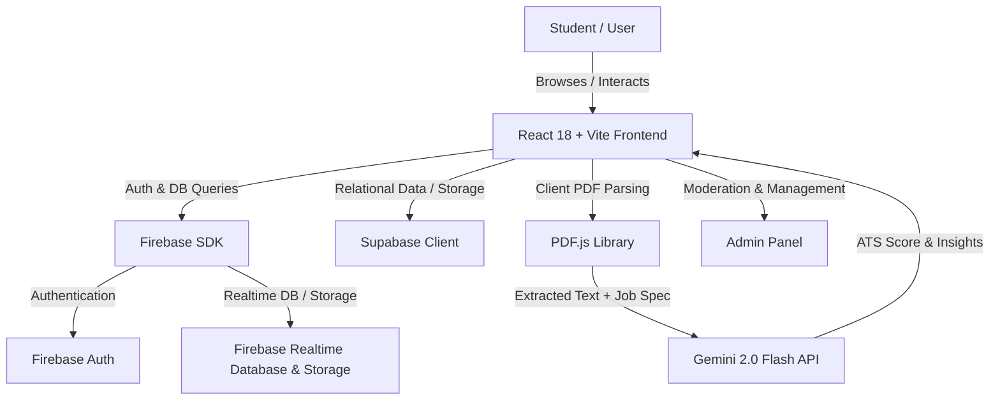

# 🎓 CampusKart — The All-in-One Campus Ecosystem & Marketplace

<div align="center">

[](https://campuskart-93.vercel.app)
[](https://reactjs.org/)
[](https://www.typescriptlang.org/)
[](https://vitejs.dev/)
[](https://tailwindcss.com/)
[](https://firebase.google.com/)
[](https://supabase.com/)
[](https://ai.google.dev/)

**A comprehensive, student-centric digital ecosystem designed to connect campus communities.**  
Buy & Sell goods, post anonymously on Campus Whisper, find hackathon teammates, discover career placements with **AI-driven Resume ATS Analysis**, explore campus events, and manage campus interactions seamlessly.

[🚀 View Live App](https://campuskart-93.vercel.app) · [✨ Features](#-key-features) · [🛠️ Tech Stack](#️-tech-stack) · [⚡ Getting Started](#-getting-started) · [📁 Project Structure](#-project-structure) · [⚙️ Environment Configuration](#️-environment-configuration)

---

</div>

## 📖 Table of Contents

- [Overview](#-overview)
- [Key Features](#-key-features)
  - [1. Campus Marketplace (Buy & Sell)](#1-campus-marketplace-buy--sell)
  - [2. Campus Whisper (Anonymous Forum)](#2-campus-whisper-anonymous-community)
  - [3. Placement & Career Hub (AI Resume Analyzer)](#3-placement--career-hub-powered-by-gemini-ai)
  - [4. Teammate & Project Finder](#4-teammate--collaborator-finder)
  - [5. Campus Events & Hackathons](#5-campus-events--hackathons)
  - [6. Real-Time Chat & Direct Messaging](#6-real-time-chat--direct-messaging)
  - [7. Comprehensive Admin Suite](#7-admin-panel--moderation)
  - [8. Support & Ticket Management](#8-support-desk--ticket-management)
- [Architecture & Data Flow](#-architecture--data-flow)
- [Tech Stack](#️-tech-stack)
- [Getting Started](#-getting-started)
  - [Prerequisites](#prerequisites)
  - [Installation](#installation)
  - [Environment Configuration](#️-environment-configuration)
  - [Running Locally](#running-locally)
  - [Building for Production](#building-for-production)
- [Project Structure](#-project-structure)
- [Security & Moderation](#-security--moderation)
- [Deployment](#-deployment)
- [Contributing](#-contributing)
- [License](#-license)

---

## 🌟 Overview

University campuses operate on tightly-knit, hyper-local economies and social circles. Students frequently face recurring challenges:
- Difficulty buying or reselling textbooks, lab coats, electronics, cycles, and hostel supplies safely within campus.
- Lack of an open, uninhibited forum to discuss campus issues, share confessionals, or ask questions without social pressure.
- Unstructured placement prep without instant, intelligent ATS resume evaluation against actual job descriptions.
- Hardship finding complementary skill sets for hackathons and semester capstone projects.

**CampusKart** resolves these issues by consolidating commerce, anonymous social interaction, career acceleration, and event discovery into a single fast, progressive web application (PWA).

---

## ✨ Key Features

### 1. 🛒 Campus Marketplace (Buy & Sell)
- **Peer-to-Peer Commerce:** Buy and sell used books, laptops, smartphones, calculators, lab aprons, hostel furniture, bicycles, and exam prep material.
- **Campus & Category Filtering:** Search listings filtered by college campus, price range, condition, and category.
- **Rich Listings:** Multi-image uploads, product condition badges, price tag negotiation, and seller contact details.
- **Seller Holiday Mode:** Sellers can pause their active listings during semester breaks or exam season to temporarily halt incoming buyer inquiries.
- **Direct Seller Inquiries:** In-app messaging and contact actions directly connect prospective buyers with verified student sellers.

### 2. 🤫 Campus Whisper (Anonymous Community)
- **Zero-Pressure Discussions:** Safe, anonymous space for campus confessions, candid advice, campus queries, and trending gossip.
- **Pseudonymous Identity System:** Automatic assignment of fun pseudonyms (e.g., *“Mystic Owl”*, *“Brave Panda”*) and avatar selection so real identities remain protected.
- **Interactive Posts & Polls:** Create rich text whispers, upload images, and launch real-time campus polls.
- **Engagement:** Upvoting/downvoting mechanism, nested comments, and a **Trending Sidebar** spotlighting popular hashtags.
- **Anonymous 1-on-1 Chats:** Real-time sliding drawer for private, anonymous direct conversations between users.

### 3. 💼 Placement & Career Hub (Powered by Gemini AI)
- **Drive Listings & Eligibility:** Browse on-campus and off-campus recruitment drives, job descriptions, CTC/stipends, and selection round details.
- **AI-Powered Resume ATS Analyzer:**
  - Client-side PDF resume parsing powered by `pdfjs-dist`.
  - Resume analysis against target job profiles using **Google Gemini 2.0 Flash** (`gemini-2.0-flash`).
  - Generates an instant **ATS Compatibility Score (0–100%)**, identified skill gaps, matched vs. missing keywords, and actionable resume optimization suggestions.
- **Interview Preparation & Tips:** Structured guidance on technical concepts, round breakdowns, and company-specific interview insights.

### 4. 🤝 Teammate & Collaborator Finder
- **Hackathon & Project Matchmaking:** Discover campus peers for hackathons, engineering capstones, research papers, and startup ventures.
- **Filter by Skill Matrix:** Filter candidates by domain (Frontend, Backend, AI/ML, Mobile App Dev, UI/UX Design, DevOps, Cloud) and graduation year.
- **Direct Outreach:** Send instant collaboration requests and initiate direct discussions.

### 5. 📅 Campus Events & Hackathons
- **Curated Calendar:** Stay up-to-date with technical symposiums, cultural fests, coding marathons, workshops, guest lectures, and sports meets.
- **Registration Links & Reminders:** Direct links to external registration portals, rulebooks, venue maps, and schedules.

### 6. 💬 Real-Time Chat & Direct Messaging
- Dedicated messaging inbox for buyer-seller conversations, collaboration requests, and peer networking.
- Real-time unread badges, push-style notifications, and conversation history.

### 7. 🛡️ Admin Panel & Moderation
- Full-fledged administrative dashboard with high-privilege operations.
- Moderation of reported marketplace listings, user flagging, college registry database management, whisper content moderation, and ticket triage.

### 8. 🎫 Support Desk & Ticket Management
- Integrated customer support ticket creation system.
- Track ticket progress (Pending, Under Review, Resolved) with detailed issue history.

---

## 🏗️ Architecture & Data Flow



---

## 🛠️ Tech Stack

| Domain | Technology / Library | Purpose |
|---|---|---|
| **Frontend Framework** | [React 18](https://react.dev/) + [TypeScript](https://www.typescriptlang.org/) | Type-safe, component-driven reactive user interface |
| **Build Tool** | [Vite](https://vitejs.dev/) | Lightning-fast HMR and optimized production bundling |
| **Styling & UI** | [Tailwind CSS](https://tailwindcss.com/) + [Lucide React](https://lucide.dev/) | Modern utility-first responsive styling & icon set |
| **Routing** | [React Router DOM v6](https://reactrouter.com/) | Client-side routing, protected routes, and deep linking |
| **Backend & Realtime** | [Firebase](https://firebase.google.com/) (Auth, RTDB, Storage) | User authentication, realtime messaging, image asset storage |
| **Database & API** | [Supabase](https://supabase.com/) | Relational database operations and structured storage |
| **Artificial Intelligence**| [Google Gemini 2.0 Flash](https://ai.google.dev/) | High-speed LLM inference for ATS resume scoring & career insights |
| **Document Processing** | [PDF.js](https://mozilla.github.io/pdf.js/) (`pdfjs-dist`) | Client-side PDF resume parsing and text extraction |
| **Hosting & CI/CD** | [Vercel](https://vercel.com/) | Global edge network deployment with automated Git builds |

---

## ⚡ Getting Started

### Prerequisites

Make sure you have the following installed on your local machine:
- **Node.js** (v18.0.0 or higher recommended)
- **npm**, **yarn**, or **pnpm**
- A **Firebase** project with Auth, Realtime Database, and Storage enabled
- A **Google AI Studio** Gemini API Key ([Get one here](https://aistudio.google.com/))
- (Optional) A **Supabase** project instance

---

### Installation

1. **Clone the repository:**
   ```bash
   git clone https://github.com/Siddhartha39/campuskart_93.git
   cd campuskart_93
   ```

2. **Navigate into the project source folder:**
   ```bash
   cd "campuskart02-main-2 3"
   ```

3. **Install dependencies:**
   ```bash
   npm install
   ```

---

### ⚙️ Environment Configuration

Create a `.env` file in the root of the project folder:

```env
# Google Gemini AI API Configuration
VITE_GEMINI_API_KEY=your_gemini_api_key_here

# Firebase Configuration
VITE_FIREBASE_API_KEY=your_firebase_api_key
VITE_FIREBASE_AUTH_DOMAIN=your_project_id.firebaseapp.com
VITE_FIREBASE_PROJECT_ID=your_project_id
VITE_FIREBASE_STORAGE_BUCKET=your_project_id.firebasestorage.app
VITE_FIREBASE_MESSAGING_SENDER_ID=your_messaging_sender_id
VITE_FIREBASE_APP_ID=your_firebase_app_id

# Supabase Configuration (if applicable)
VITE_SUPABASE_URL=https://your-project.supabase.co
VITE_SUPABASE_ANON_KEY=your_supabase_anon_key
```

---

### Running Locally

Start the Vite local development server:

```bash
npm run dev
```

The application will be accessible at `http://localhost:5173`.

---

### Building for Production

Compile TypeScript and build the optimized production assets:

```bash
npm run build
```

Preview the production build locally:

```bash
npm run preview
```

---

## 📁 Project Structure

```text
campuskart_93/
├── campuskart02-main-2 3/
│   ├── public/                 # Static assets, PWA manifests, icons
│   ├── src/
│   │   ├── components/
│   │   │   ├── admin/          # Admin dashboard, user & content moderation
│   │   │   ├── auth/           # Login, registration, campus onboarding
│   │   │   ├── buy/            # Marketplace item exploration & item details
│   │   │   ├── campusWhisper/  # Anonymous forum, polls, whisper feed & modal
│   │   │   ├── common/         # Reusable UI elements (modals, badges, loaders)
│   │   │   ├── dashboard/      # Main student dashboard & quick shortcuts
│   │   │   ├── download/       # App download and PWA installation prompt
│   │   │   ├── events/         # Campus events, hackathons & fest calendar
│   │   │   ├── layout/         # Navigation bar, drawer menus, footer
│   │   │   ├── legal/          # Privacy policy, terms of service
│   │   │   ├── messages/       # In-app chat, direct messaging
│   │   │   ├── notifications/  # Notification center and alerts
│   │   │   ├── placements/     # Placement drives, job specs, AI resume reviewer
│   │   │   ├── profile/        # User profile, past listings, holiday toggle
│   │   │   ├── sell/           # Sell item form with multi-image uploader
│   │   │   ├── settings/       # Account preferences, notifications settings
│   │   │   ├── support/        # Ticket submission, help center, ticket history
│   │   │   ├── teammates/      # Hackathon & project teammate discovery
│   │   │   └── welcome/        # Landing page for unauthenticated visitors
│   │   ├── config/
│   │   │   ├── firebase.ts     # Firebase app initialization & auth configuration
│   │   │   └── supabase.ts     # Supabase client setup
│   │   ├── contexts/
│   │   │   └── AuthContext.tsx # User authentication state provider
│   │   ├── data/
│   │   │   ├── anonymousNames.ts # Random alias generator for Campus Whisper
│   │   │   └── colleges.ts       # Supported colleges registry
│   │   ├── hooks/
│   │   │   ├── useAnonymousChat.ts # Real-time anonymous messaging hook
│   │   │   ├── usePoll.ts          # Interactive polling state hook
│   │   │   └── useWhisper.ts       # Whisper feed, upvoting & commenting logic
│   │   ├── lib/
│   │   │   ├── gemini.ts       # Gemini 2.0 Flash AI API integration
│   │   │   └── resumeUtils.ts  # PDF text extraction & ATS parsing utilities
│   │   ├── types/
│   │   │   ├── index.ts        # Core TypeScript interfaces (User, Item, etc.)
│   │   │   └── whisper.ts      # Anonymous posts, comments & poll schemas
│   │   ├── utils/
│   │   │   └── initializeColleges.ts # College list hydration helper
│   │   ├── App.tsx             # Root router and layout definition
│   │   ├── index.css           # Tailwind CSS directives & global styling
│   │   └── main.tsx            # React application entry point
│   ├── index.html              # HTML template
│   ├── package.json            # Scripts & project dependencies
│   ├── tailwind.config.js      # Tailwind CSS theme extension
│   ├── tsconfig.json           # TypeScript configuration
│   └── vite.config.ts          # Vite build settings
└── README.md                   # Project documentation
```

---

## 🔒 Security & Moderation

- **Anonymous Privacy:** Real student names, emails, and phone numbers are completely decoupled from whispers and anonymous chats.
- **Reporting & Flagging:** Every marketplace item and whisper includes a reporting mechanism triggering reviews in the Admin Panel.
- **Client-Side AI Document Processing:** Resume parsing occurs directly in the user's browser, transmitting only the extracted text payload securely to the Gemini API.
- **Holiday Mode Protection:** Protects sellers against unfulfilled orders or spam when away from campus.

---

## 🚀 Deployment

The project is pre-configured for seamless deployment with [Vercel](https://vercel.com/):

1. Import the GitHub repository into your Vercel dashboard.
2. Set the Root Directory to the folder containing `package.json` (`campuskart02-main-2 3` or root).
3. Add the required environment variables (`VITE_GEMINI_API_KEY`, `VITE_FIREBASE_*`, `VITE_SUPABASE_*`).
4. Click **Deploy**.

---

## 🤝 Contributing

Contributions, issues, and feature requests are welcome!

1. Fork the project.
2. Create your feature branch (`git checkout -b feature/AmazingFeature`).
3. Commit your changes (`git commit -m 'Add some AmazingFeature'`).
4. Push to the branch (`git push origin feature/AmazingFeature`).
5. Open a Pull Request.

---

## 📄 License

This project is licensed under the [MIT License](LICENSE).

---

<div align="center">

Made with ❤️ for students worldwide by [Siddhartha](https://github.com/Siddhartha39)

</div>
